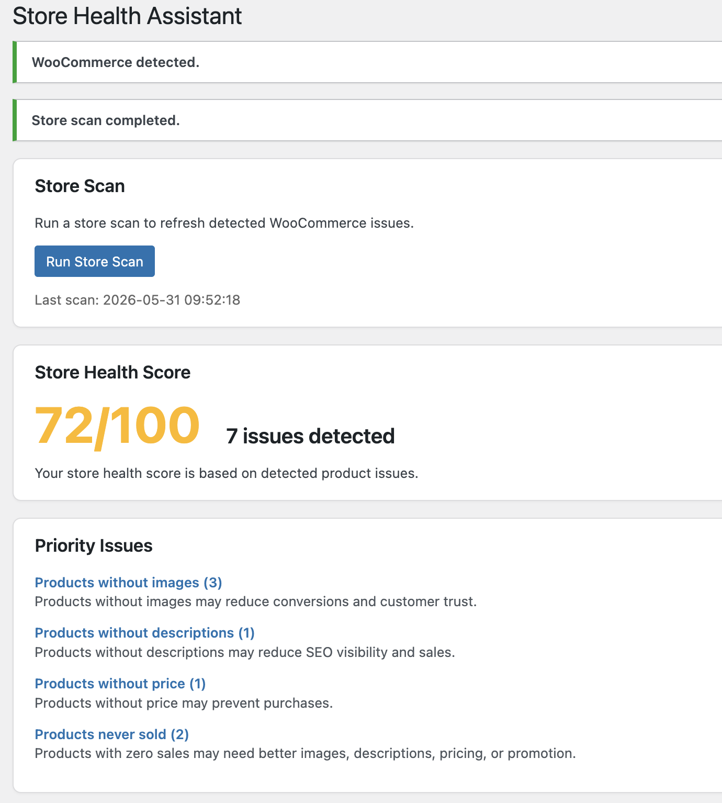

# Store Health Assistant for WooCommerce

Find hidden WooCommerce product issues before they hurt your sales.

Store Health Assistant scans your WooCommerce store and highlights missing images, missing descriptions, missing prices, stock problems, and products that never sold.

## Features

- Store Health Score
- Priority Issues
- Products without images
- Products without descriptions
- Products without price
- Out of stock products
- Low stock products
- Products never sold

## Screenshots

## Dashboard

The dashboard gives store owners a quick health score and a prioritized list of issues to fix.

## Installation

1. Upload plugin to WordPress plugins directory
2. Activate the plugin
3. Open "Store Health" from WordPress admin

## Roadmap

- Better UI
- Export reports
- Email summaries
- AI suggestions
